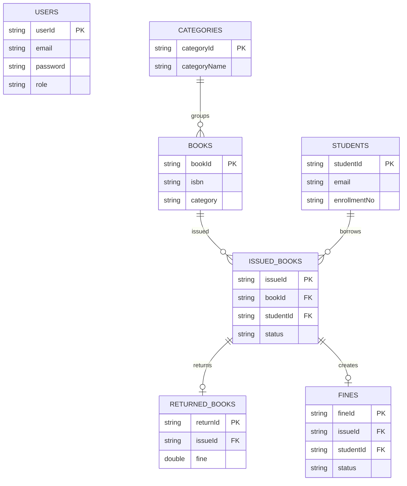

# ER Diagram

```mermaid
erDiagram
    USERS {
        string userId PK
        string email
        string password
        string role
    }
    STUDENTS {
        string studentId PK
        string email
        string enrollmentNo
    }
    BOOKS {
        string bookId PK
        string isbn
        string category
    }
    CATEGORIES {
        string categoryId PK
        string categoryName
    }
    ISSUED_BOOKS {
        string issueId PK
        string bookId FK
        string studentId FK
        string status
    }
    RETURNED_BOOKS {
        string returnId PK
        string issueId FK
        double fine
    }
    FINES {
        string fineId PK
        string issueId FK
        string studentId FK
        string status
    }
    BOOKS ||--o{ ISSUED_BOOKS : issued
    STUDENTS ||--o{ ISSUED_BOOKS : borrows
    ISSUED_BOOKS ||--o| RETURNED_BOOKS : returns
    ISSUED_BOOKS ||--o| FINES : creates
    CATEGORIES ||--o{ BOOKS : groups
```
