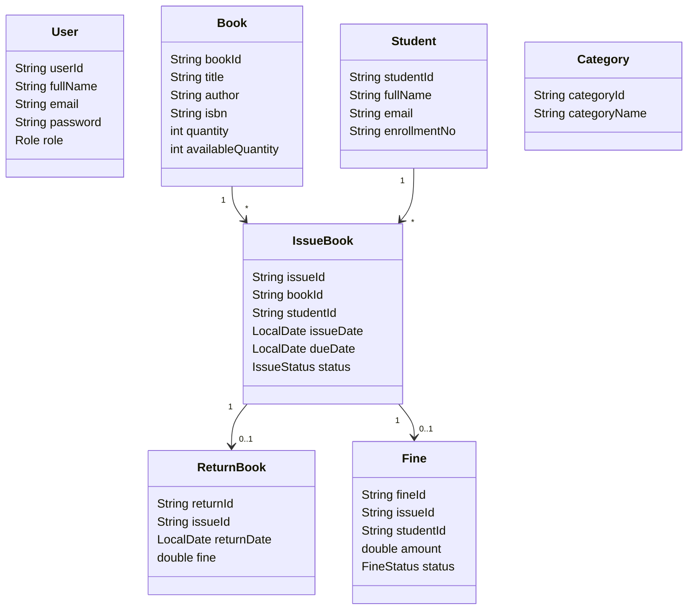

# UML Class Diagram

```mermaid
classDiagram
    class User {
      String userId
      String fullName
      String email
      String password
      Role role
    }
    class Student {
      String studentId
      String fullName
      String email
      String enrollmentNo
    }
    class Book {
      String bookId
      String title
      String author
      String isbn
      int quantity
      int availableQuantity
    }
    class Category {
      String categoryId
      String categoryName
    }
    class IssueBook {
      String issueId
      String bookId
      String studentId
      LocalDate issueDate
      LocalDate dueDate
      IssueStatus status
    }
    class ReturnBook {
      String returnId
      String issueId
      LocalDate returnDate
      double fine
    }
    class Fine {
      String fineId
      String issueId
      String studentId
      double amount
      FineStatus status
    }
    Book "1" --> "*" IssueBook
    Student "1" --> "*" IssueBook
    IssueBook "1" --> "0..1" ReturnBook
    IssueBook "1" --> "0..1" Fine
```
